# **Laboratorio N2**

**Curso:** Tópicos Especiales en Telemática <br>
**Título:** Contenerización: Docker.<br>
**Objetivo:** Desarrollar habilidades en la aplicación de contenedores para la distribución y despliegue de aplicaciones distribuidas.<br>
**Duración:** 35 mins.<br>

*******

**Tabla de Contenido**

1. [Introducción](#introduction)
2. [Recursos](#resources)
3. [Desarrollo](#development) 
4. [Gestionando y Desplegando Contenedores](#deployment) <br>

*******

<div id='introduction'/> 

### **1. Introducción**

Los contenedores pueden ser considerados unos de los desarrollos tecnológicos más interesantes en la industria de TI en los últimos años. En la actualidad, la mayoría de las organizaciones está migrando sus aplicaciones apalancándose en esta tecnología. 

Este laboratorio nos permitirá desarrollar las habilidades básicas que nos permitan el despliegue de contenedores, particularmente Docker.


*******

<div id='resources'/> 

### **2. Recursos**

Para el desarrollo de este laboratorio se requiere una cuenta en AWS que le permita desplegar una instancia EC2 para instalar sistema operativo Linux Ubuntu así como el engine de docker.

*******

<div id='development'/>  

### **3. Desarrollo**

En las siguientes subsecciones se describen el conjunto de pasos que se requieren para el desarrollo de la actividad.

#### **3.1. Instancie una máquina EC2 en la consola de AWS.:**

Diríjase al “home” de la consola de administración de AWS. Escoja el servicio de EC2. En el panel izquierdo seleccione la opción de “Instances” seleccione la opción “launch instances” y ejecute lo siguientes pasos:
* **Name and Tags:**
  * **Name:** WebServer- CMS.
  * **Application and OS Images (Amazon machine image):**
    * Escoja la imagen de Amazon Machine Image (AMI) la cual contiene la imagen del sistema operativo. Seleccione Ubuntu. Ahí, seleccione Ubuntu server 22.04 LTS (HVM), SSD Volume Type. Free Tier.
* **Instance type:** Seleccione el tipo de instancia t2.micro (columna type) 
* **Key pair (login):** Seleccione una llave existente o en su defecto cree una nueva.
* **Network Settings:** Ahora configure, los siguientes parámetros (click en edit):
  * **VPC:** VPC por defecto
  * **Subnet:** Subred Publica.
  * **Auto-assign Public IP:** Enable
  * **Firewall (security groups):**
    * Seleccione la opción de un crear un segurity group que permita el ingreso de tráfico  ssh. 
  * **Configure storage:**
    * 1 x 8 Gib gp2 root volume 

A continuación, proceda a establecer una sesión ssh con la instancia creada. 

<div id='instance'/> 

#### **3.2. Instalación de Docker:**

A continuación se procede a realizar la instalación de docker en la instancia creada. Para esto, se toman las instrucciones proporcionadas por docker para la instalación en esta distribución (Ubuntu 22.04), las cuales pueden ser consultadas en https://docs.docker.com/engine/install/ubuntu/ .

Para esto vamos a ejecutar los siguientes pasos:

*	Pre-requisitos : Antes que cualquier cosa, procedamos a verificar que la máquina no tenga ninguna versión de Docker instalada, para esto, por favor, ejecute el siguiente comando:

```sh
 $ sudo apt-get remove docker docker-engine docker.io containerd runc 
```
* Configuración del entorno: 
  * Actualice el index del páquete apt-get:

    ```sh
    $ sudo apt-get update
    ```
  * Instale los paquetes necesarios para permitir a apt el utilizar repositorios sobre https:

    ```sh
    $ sudo apt-get install \
        ca-certificates \
        curl \
        gnupg \
        lsb-release
    ```
  * Se hace necesario agregar la clase oficial GPG de Docker:
      ```sh
      $ sudo mkdir -m 0755 -p /etc/apt/keyrings
      $ curl -fsSL https://download.docker.com/linux/ubuntu/gpg | sudo gpg --dearmor -o /etc/apt/keyrings/docker.gpg
    ```

  * Aplique el siguiente comando para establecer el repositorio “stable”.
      ```sh
      $ echo \
      "deb [arch=$(dpkg --print-architecture) signed-by=/etc/apt/keyrings/docker.gpg] https://download.docker.com/linux/ubuntu \
      $(lsb_release -cs) stable" | sudo tee /etc/apt/sources.list.d/docker.list > /dev/null
      ```
* Instalación: Ahora se procede a instalar el docker engine:

```sh
$ sudo apt-get update
```
Solo y en caso tal reciba un error, ejecute los siguientes comandos 

```sh
$ sudo chmod a+r /etc/apt/keyrings/docker.gpg
$ sudo apt-get update
```
* Instalar la última versión de docker y docker-compose disponible para ubuntu:
```sh
$ sudo apt-get install docker-ce docker-ce-cli containerd.io docker-buildx-plugin docker-compose-plugin
```

A continuación, se procede a verificar la instalación del servicio de docker. Para esto digite el siguiente comando:

```sh
$ sudo docker container run hello-world
```

Usted debe observar una salida de pantalla como se ilustra en la siguiente figura:

 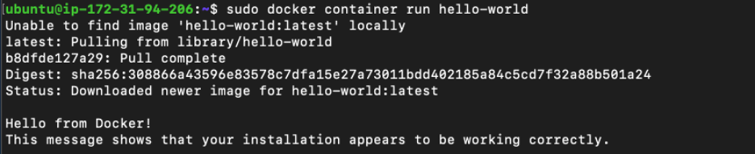


#### **3.3. Verificando el funcionamiento de Docker como servicio:**

Como cualquier otro servicio en el sistema operativo linux, el funcionamiento de docker puede ser verificado con los siguientes comandos:

* Para verificar el estado del servicio:

  ```sh
  $ sudo systemctl status docker.service
  ```

* Verificar la versión de docker instalad:

  ```sh
  $ sudo docker version
  ```
* En caso tal, el servicio de docker no este ejecutándose, puede iniciar el servicio con el siguiente comando:

  ```sh
  $ sudo systemctl start docker
  ```

* Para indicarle al sistema operativo que inicie automáticamente el servicio de docker cada vez que se inicie la máquina, ejecute el siguiente comando:

  ```sh
  $ sudo systemctl enable docker
  ```

* Para reiniciar el servicio de docker, ejecute el siguiente comando:

  ```sh
  $ sudo systemctl restart docker
  ```

*******

<div id='deployment'/> 

#### **4. Desplegando y gestionando imágenes, así como contenedores:**

#### **4.1. Docker file:**

En esta sección vamos a desplegar un servidor web apache utilizando contenedores. Todo esto lo vamos a realizar a partir de un archivo que se denomina dockerfile. Al final vamos a poder acceder a la siguiente URL:

http://PublicIPAddress:8080/test.html

Como pueden observar estamos utilizando en este ejercicio el puerto 8080, por esta razón se hace necesario que usted agregue en el security group de su máquina los permisos para que el tráfico de entrada a este puerto se permita. Para esto en el menú del servicio de EC2 de AWS, por favor seleccione la opción de security groups y proceda a agregar la regla que permita el tráfico entrate al puerto 8080 TCP, desde cualquier dirección (Anywhere IPv4/Anywhere IPv6). 

 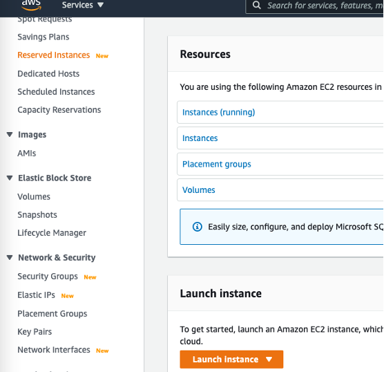

En esta vista seleccione el security group que definió para su instancia (p.ej., SG-UbuntuDocker) y en la pestaña de abajo seleccione la opción de "**Inbound rules**" y de click en "**Edit Inbound Rules**"

 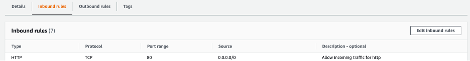

Ahora agregue la regla para permitir el ingreso de tráfico http por el puerto 8080 y guarde los cambios.

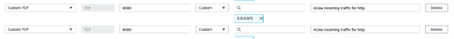

**Nota:** Recuerde que no se hace necesario reiniciar la instancia una vez modifique las directivas del security group.

Ahora se procederá a crear un directorio en el home de su máquina virtual, de la siguiente forma:

```sh
$ sudo mkdir mywebserver
$ cd mywebserver
```
Una vez en este directorio vamos a crear un archivo test.html con el siguiente código ejemplo:

```sh
$ sudo nano test.html
```

```html
<!doctype html>
<html lang="en">
<head>
  <meta charset="utf-8">
  <title>Docker Apache</title>
</head>
<body>
  <h2>Hello from Apache Web Server container...</h2>
</body>
</html>
```

Ya que tenemos una página personalizada para el ejemplo, vamos a crear un archivo Dockerfile para la instalación del servidor web apache.

```sh
$ sudo nano Dockerfile
```

```html
FROM httpd:2.4
COPY ./test.html /usr/local/apache2/htdocs/
```

Recuerde que la directiva FROM nos indica la imagen base que estamos tomando, en este caso la del servidor apache versión 2.4. El comando COPY nos permite copiar nuestro archivo test.html en el directorio de htdocs de apache como objeto/recurso web a ser accedido.

Ahora vamos a proceder a construir nuestra imagen a partir de este archivo Dockerfile. Para esto utilizamos el siguiente comando:

```sh
$ sudo docker build -t my-apache2 .
```

 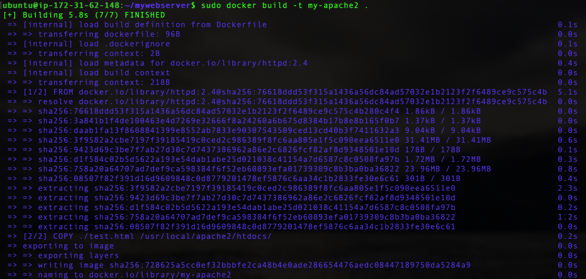

Puede verificar la creación de la imagen con el siguiente comando:

```sh
sudo docker image ls 
```

 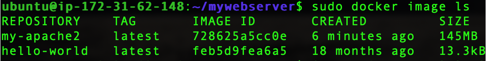

Una vez creada, vamos a proceder a ejecutar nuestro contenedor con el servidor web apache.

```sh
$ sudo docker run -dit --name my-running-app -p 8080:80 my-apache2
```

Este comando permite ejecutar el contenedor en backgroud (-d). El nombre va a ser my-running-app (--name) el cual se ejecuta desde la instancia my-apache2. El servidor web estará escuchando peticiones en el puerto (-p) 8080 de la máquina el cual se redirige al puerto 80 del contenedor.

Con el siguiente comando podemos verificar el funcionamiento de nuestro contenedor:

```sh
$ sudo docker ps
```

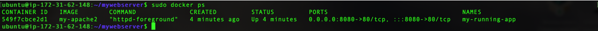

Finalmente, para verificar el funcionamiento de nuestro servidor, vamos a ejecutar un browser con la dirección pública de nuestro servidor web en el puerto 8080 accediendo el recurso test.html. El resultado debe ser similar al observado en la figura.

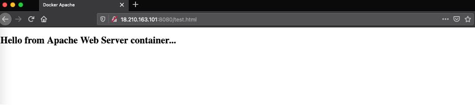

#### **4.1. Docker Compose:**

Para poder ejecutar aplicaciones con múltiples contenedores sobre una misma instancia de docker engine, una forma de hacerlo es utilizar la herramienta docker compose. Es así como docker compose es la herramienta que nos permite definir, y ejecutar aplicaciones que contengan múltiples contenedores. Recuerde por favor tener instalado antes el docker engine. En esta parte del laboratorio, vamos a desplegar un CMS (wordpress), el cual requiere dos contenedores: uno para el CMS como tal y el otro para la persistencia de datos (MySQL/MariaDB). 

Para poder desplegar el wordpress vamos a crear un directorio para el proyecto en el directorio raiz (/home/ubuntu):

```sh
$ sudo mkdir wordpress
$ cd wordpress
```
En el directorio wordpress, vamos a crear un archivo llamado docker-compose.yml y el cual tiene la siguiente estructura:

```html
version: '3.1'

services:

  wordpress:
    image: wordpress
    restart: always
    ports:
      - 80:80
    environment:
      WORDPRESS_DB_HOST: db
      WORDPRESS_DB_USER: exampleuser
      WORDPRESS_DB_PASSWORD: examplepass
      WORDPRESS_DB_NAME: exampledb
    volumes:
      - wordpress:/var/www/html

  db:
    image: mysql:5.7
    restart: always
    environment:
      MYSQL_DATABASE: exampledb
      MYSQL_USER: exampleuser
      MYSQL_PASSWORD: examplepass
      MYSQL_RANDOM_ROOT_PASSWORD: '1'
    volumes:
      - db:/var/lib/mysql

volumes:
  wordpress:
  db:
```

Como se puede observar, se muestra un archivo simple "compose" que define una aplicación Multiservicio. Como se mencionó anteriormente, el nombre por defecto para un archico compose es “docker-compose.yml”. En este caso el archivo define la sección para el wordpress así como la sección para la bases de datos. Se puede observar que el archivo tiene tres (3) secciones:
* version: Esta sección es de carácter obligatoria y siempre debe ser la primera línea del archivo Compose. Indica la versión de formato del archivo compose y no se debe confundir con la versión del docker engine así como del docker compose.
* services: En esta sección es donde se definen los diferentes servicios que componen la aplicación que se desea desplegar. Para este caso, el wordpress y la base de datos. De esta forma compose va a desplegar cada uno de estos servicios en un contenedor propio.
* Volumes: Esta sección le indica al docker donde se le indica al docker para crear nuevos volúmenes 

Ahora vamos a proceder a desplegar los contenedores a través del siguiente comando:

```sh
$ sudo docker compose up -d
```
El flag -d indica que el proceso se estará ejecutando en background.

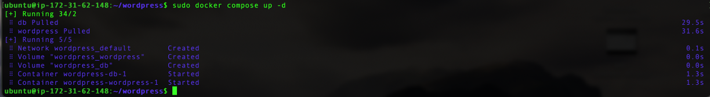

En este punto vamos a verificar las imágenes que se encuentran en la máquina actualmente así como los contenedores que se encuentran en ejecución. Para observar la información de loas imágenes digite el comando:

En este punto vamos a verificar las imágenes que se encuentran en la máquina actualmente así como los contenedores que se encuentran en ejecución. Para observar la información de loas imágenes digite el comando:

```sh
$ sudo docker compose ps
```

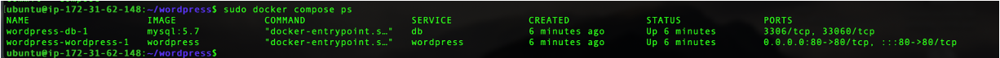

Como puede observar, este comando nos proporciona información similar y un poco mas detallada sobre los contenedores que están en ejecución en la instancia.

Finalmente, para verificar e interactuar con el servicio/aplicación desplegada, inicie una nueva ventana/pestaña de un navegador (browser) y digite en el campo URL bien sea el nombre de la máquina en AWS (Public IPv4 DNs ) o dirección IP pública (Public IPv4 address). A continuación, debe observar la pantalla de bienvenida para la configuración del sitio Wordpress con lo cual puede proceder a la configuración del mismo. Por favor, recuerde modificar el security group para permitir el tráfico al puerto 80 TCP (HTTP).

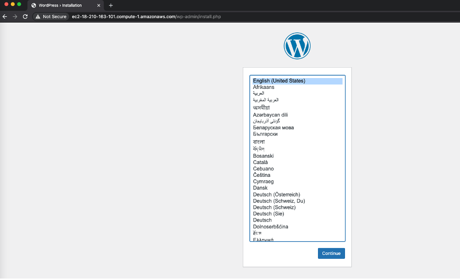

*******